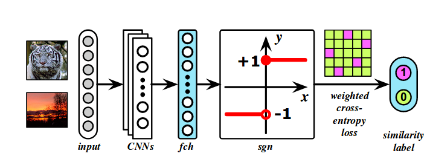
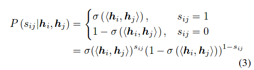
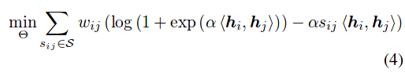
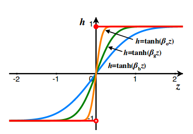
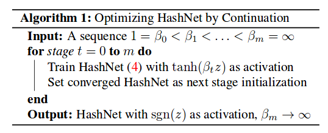

## hashNet笔记
图像检索领域的应用，不仅要求有比较好的检索效果，而且计算相似性的速度要快，从而可以面对百万级别的数据量。本文通过將图像特征编码限制在{-1,1},可以产生二进制hash编码，从而很快的比较两张图片的相似性。[详情见原文](https://arxiv.org/pdf/1702.00758.pdf) 作者代码[github](https://github.com/thuml/HashNet)

### 1.总览

输入两张图片，经过任意的卷积网络得到各自的fch，fch经过sgn(符号函数)得到二值hash编码，二值hash编码输入到pairwise型损失函数，监督label是两张图片是否相似。

**训练batchsize为256时，会切成上下128,128两部分，然后计算对应的两张图片的pairwise损失**

### 2.损失函数建模

一对hash编码的Hamming距离与编码的内积的关系如下,K是编码长度

$$dist_H(h_i,h_j)=\frac{1}{2}(K-\left< h_i,h_j \right>)$$
可以看出，内积越大的，Hamming距离越小。因此构建weighted maximum likehood如下

$$\log P(S|H)=\sum_{S_{i,j}\in S}w_{i,j}\log P(s_{i,j}|h_i,h_j)$$
其中 $w_{i,j}$是平衡正负样本用的，概率建模为下

也就是说，内积越大，相似性越高，是同一种类别的概率就越大。

其中激活函数是sigmoid,作者稍微修改了

$$\sigma(x)=1/(1+e^{-ax})$$

目的是为了更有效的反向传播

那么我们的目标就是最小化$-\log P$,作者重写了一下公式

### 3.如何产生{-1,+1}的编码

可以用符号函数，但是符号函数在非零处的导数均为0,不能用反响传播训练，因此作者考虑在训练的时候用tanh函数逼近符号函数。要注意的是，最后测试的时候还是用符号函数吧。

$$\lim_{\beta \to \infty} tanh(\beta z)=sign(z)$$

如下图所示

作者在训练的时候，首先初始化$\beta$为1,随着训练的轮次逐渐加大$\beta$，使得其越来越逼近符号函数，使得输出越来越靠近-1或者+1,从而实现二值hash编码。作者表示增加10次就差不多了。

训练算法

### 4.两个定理

作者证明了两个定理，用于说明方法的科学性

a. hashNet的损失$L(\theta)$（输出编码就是二值）不会随着$\beta$的增大而改变。主要是为了说明$\beta$从10变成无穷大，从而转换成符号函数时，也不会影响之前的训练结果吧。

这个定理比较好证明，因为倍乘不会影响符号函数和tanh函数的正负。

b. 当使用tanh函数代替符号函数训练时，损失函数定义为$J(\theta)$，优化$J(\theta)$的时候，$L(\theta)$也会降低，即也被优化了。这就说明了训练的时候这种替代是合理的。

这个证明挺有意思的，可以参考原文。

